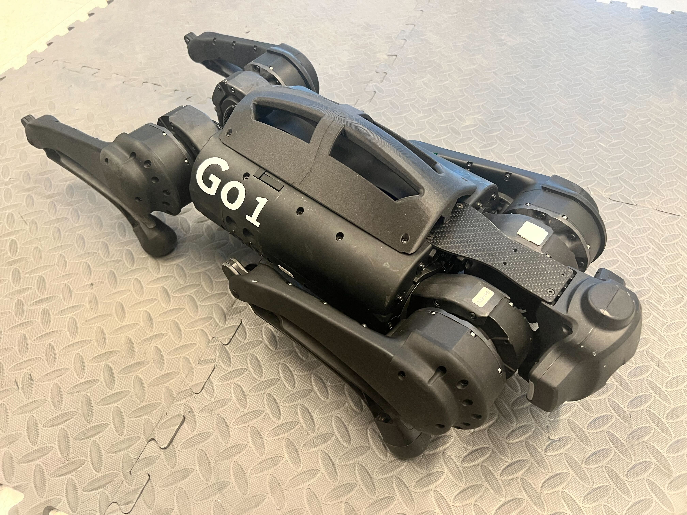
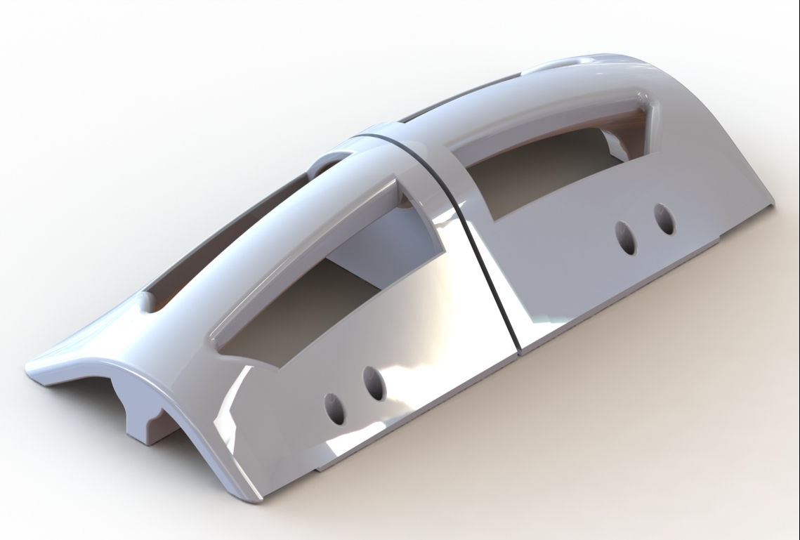
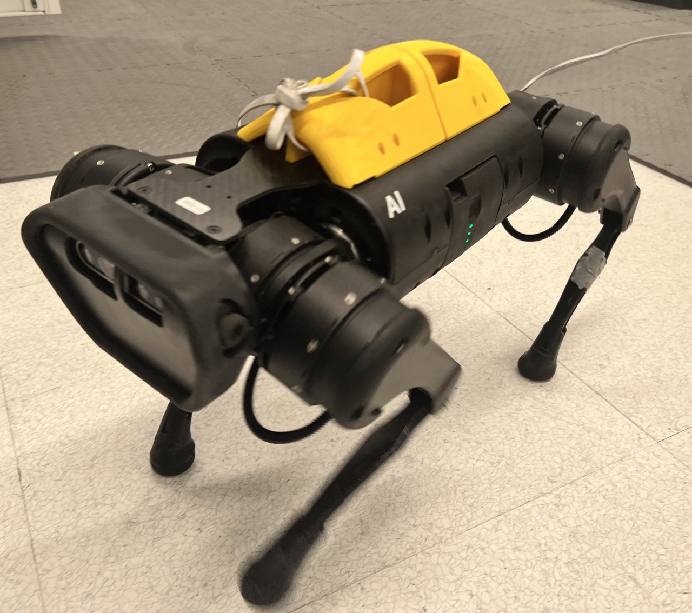

# Robot Parts

A collection of hardware components to assist in robotics research.
The `.STL` files for each part is contained in its own folder.

If you find Robot Parts useful in your research. Please cite `DayDreamer`, the original work where these appeared.

```
@article{Wu22CoRL_DayDreamer,
  title = {Daydreamer: World Models for Physical Robot Learning},
  author = {Wu, Philipp and Escontrela, Alejandro and Hafner, Danijar and Goldberg, Ken and Abbeel, Pieter},
  journal = {Proceedings of Machine Learning Research},
  year = {2022},
}
```

### Go1 Turtle Shell
A protective shell for the Unitree Go1 quadruped. This is the same shell as the A1 but with screw hole pattern for the Go1.
Additionally the version for the Go1 is a single contiguous part.

<p align="middle">
    
    
</p>

### A1 Turtle Shell
A protective shell for the Unitree A1 quadruped. Features:
 * Protects any plugged in cables from damage
 * Handles for easier transportation
 * Open access to all ports on top of the robot

<p align="middle">
    
    
</p>


# Projects that use Robot Parts

DayDreamer: World Models for Physical Robot Learning (Philipp Wu*, Alejandro Escontrela*, Danijar Hafner*, Ken Goldberg, Pieter Abbeel)
 * [paper](https://arxiv.org/abs/2206.14176) | [website](https://danijar.com/project/daydreamer) | [code](https://github.com/danijar/daydreamer)

A Walk in the Park: Learning to Walk in 20 Minutes With Model-Free Reinforcement Learning (Laura Smith*, Ilya Kostrikov*, Sergey Levine)
 * [paper](https://arxiv.org/abs/2208.07860) | [website](https://sites.google.com/berkeley.edu/walk-in-the-park) | [code](https://github.com/ikostrikov/walk_in_the_park)

Learning and Adapting Agile Locomotion Skills by Transferring Experience (Laura Smith, J. Chase Kew, Tianyu Li, Linda Luu, Xue Bin Peng, Sehoon Ha, Jie Tan, Sergey Levine)
 * [paper](https://arxiv.org/abs/2304.09834)
